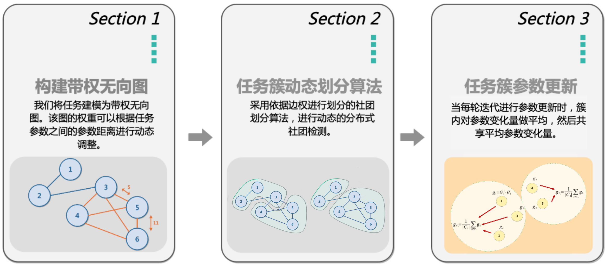
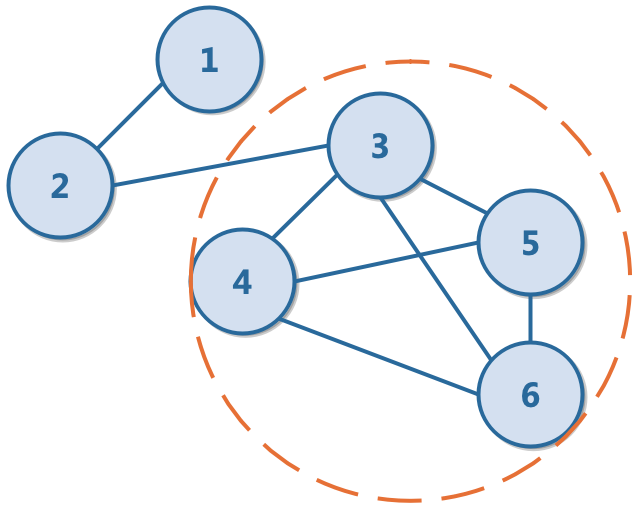
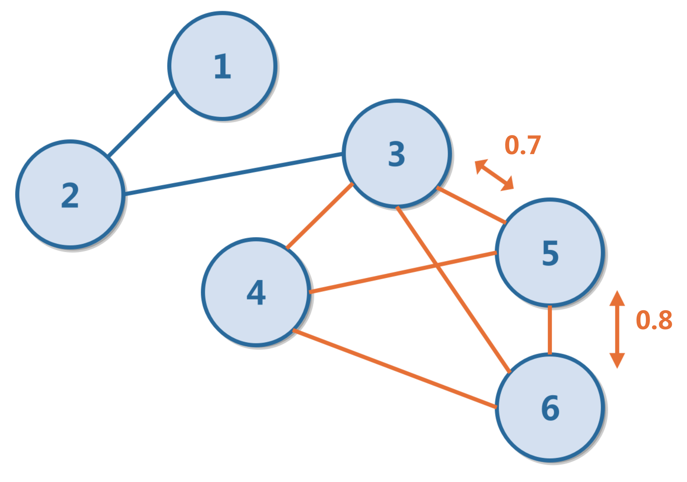
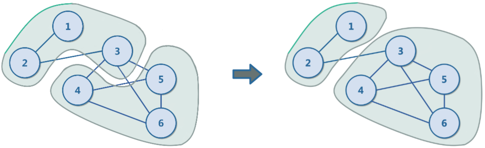
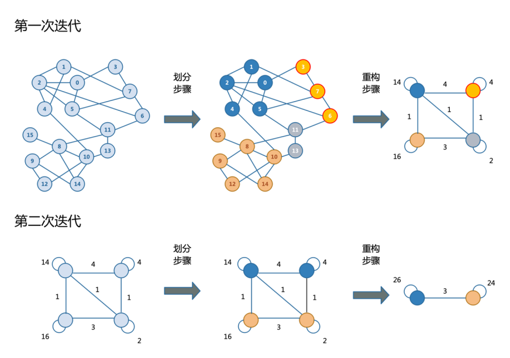
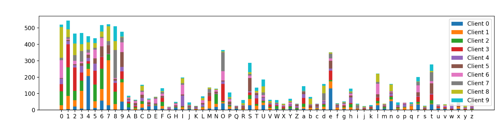
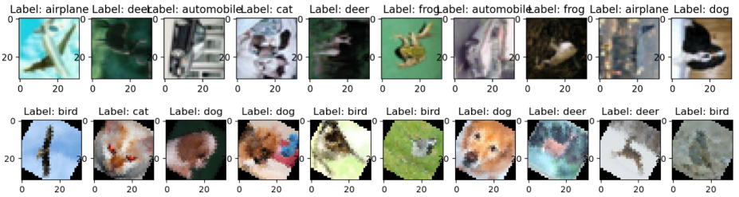
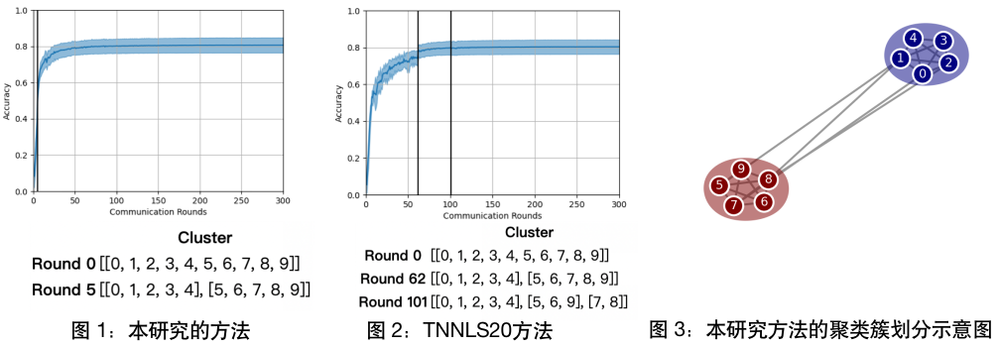
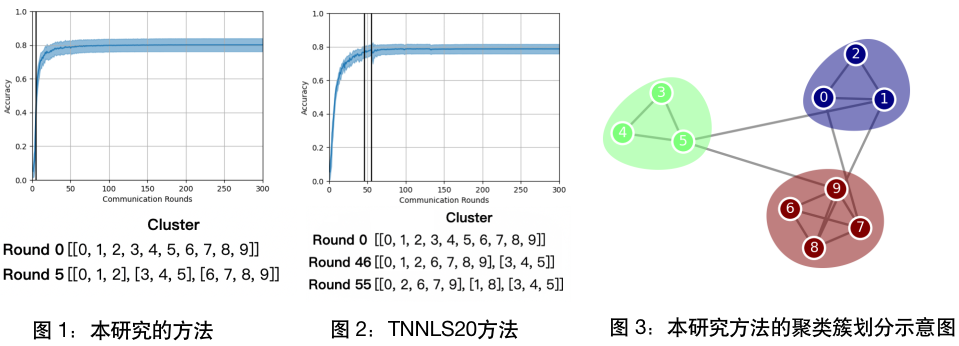
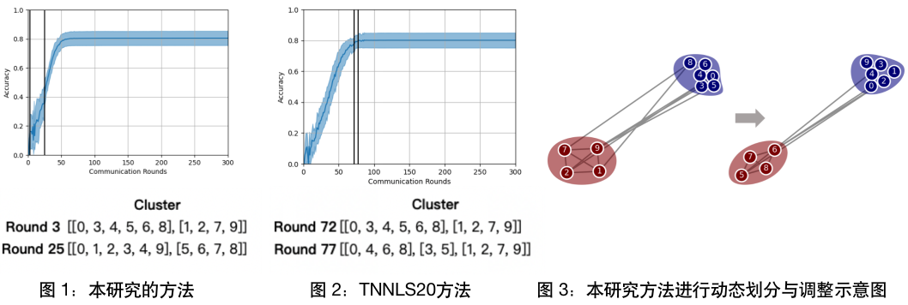

<!--
 * @Descripttion: 
 * @Version: 1.0
 * @Author: ZhangHongYu
 * @Date: 2021-12-23 18:53:12
 * @LastEditors: ZhangHongYu
 * @LastEditTime: 2022-04-01 20:27:20
-->
<p align="center">

</p>

<div align="center">

# FedCom: 基于社区检测的多任务聚类联邦学习
[](https://github.com/orion-orion/FedCom) [](https://github.com/orion-orion/FedCom/blob/master/LICENSE) [](https://github.com/orion-orion/FedCom) 
<br/>
[](https://github.com/orion-orion/FedCom) [](https://github.com/orion-orion/FedCom)
</div>

## 1 简介
[FedCom](https://github.com/orion-orion/FedCom)为SWPU2022届本科毕业设计《基于社区检测的多任务聚类联邦学习》。本研究提出了一种多任务聚类联邦学习（clustered federated learning, CFL）的新方法，该方法的特点是**基于社区检测（community detection）来进行聚类簇的动态划分**。本研究的方法规避了聚类簇由人工指定的弊端，从而在算法后期对前期错误划分进行动态修正，缓解了因前期划分失误带来的负面影响。

在三个不同数据集上进行的实验表明，相比本文对比的其它几个联邦学习方法，本文提出的基于动态划分的多任务聚类联邦学习方法在大多数情况下表现更好。在大多数情况下，本文所提出的算法划分更加准确，达到的准确率更高，收敛速度更快。其中于本文的算法具有动态调整聚簇的特性，所以即使在最初的几轮迭代中划分错误，也能在后面的迭代中对错误的聚簇划分进行调整，从而取得更佳的精度表现。

## 2 算法流程描述

### 2.1 算法整体流程
整体算法流程分为构建带权无向图、任务簇动态划分、任务簇参数更新三个部分，如下图所示：



### 2.2 算法分步描述

#### 2.2.1 构建带权无向图
本研究将 $n$ 个客户端节点视为带权无图 $\mathcal{G}=(\mathcal{V},\mathcal{E})$ , 这里 $\mathcal{V}$ 代表各客户端节点， $\mathcal{E}$ 代表各客户端节点之间的交互。定义节点 $k$ 的邻居为满足 $(k, l)\in\mathcal{E}$ 的节点 $l$ 的集合。我们设 $a_{kl}$ 为节点 $l$ 和节点 $k$ 之间的边权。下图展示了 $6$ 节点的所有邻居：



在实际运行环境下，预先并不知道任务之间的关系，便无法预先为边赋权。本研究认为节点数据分布相似性（边权）可以由模型学习到。可以证明分布相似性和参数间的余弦距离相关<sup>[1]</sup>：

$$
a_{k l}=\frac{\left\langle\Delta \theta_{k}, \Delta \theta_{l}\right\rangle}{\lVert \Delta \theta_{k}\rVert \lVert\Delta \theta_{l} \rVert}
$$

边权的动态调整如下图所示：



#### 2.2.2 聚类簇动态划分算法
首先，将图的一个社团划分和一个聚类簇相对应。然后，采用依据边的权重划分社团的社团划分算法<sup>[2]</sup>。该算法在每一轮迭代更新参数后先进行试探性的社团检测。此外，本研究采用模块度$M$对划分质量进行评估，如果划分后的模块度 $M_t$ 相对于上一轮的模块性 $M_{t-1}$ 取得了 $\varepsilon$ 的增幅，即： $M_{t}-M_{t-1}>\varepsilon$ ，则采用当前划分。



本研究采用的Louvain社区检测算法<sup>[2]</sup>是一个采用贪心策略的多次迭代算法，每一次迭代都由划分和重构两部分组成。其中划分步骤只使用局部调整优化模块性，做为初步的簇划分；重构步骤则会聚合当前划分出的聚簇，形成新图用于下一次迭代。



#### 2.2.3 聚类簇参数更新

以任务簇为单位进行参数更新的共享。也即相同任务簇内的节点对参数更新求加权平均，其权重根据各任务节点的样本数量来分配，如下式所示：

$$
\Delta \theta_{k}=\sum_{t \in C_{k}} \frac{n_{t}}{n_{C_{k}}} \Delta \theta_{t}
$$

如下图所示，簇 $C_1$ 中根据节点 $1、2、3$ 的参数更新进行加权平均，簇 $C_2$ 中根据节点 $4、5$ 的参数更新进行加权平均。


## 3 实验设计

### 3.1 数据集Non-IID划分
采用联邦学习的benckmark数据集：EMNIST、CIFAR10、FEMNIST等数据集<sup>[3]</sup>对模型进行评估，采用Dirichlet分布对数据集进行Non-IID划分。下图是对EMNIST数据集采用Dirichlet分布示意图：



### 3.2 采用图像翻转法初始化簇结构

假设有 $10$ 个client， $k$ 个初始化簇结构：

- $k=2$ ，则client $1-5$ 不变，client $6-10$ 的数据进行旋转 $180°$ 。

- $k=3$ ，则client $1-3$ 不变，client $4-6$ 中图片旋转 $120°$ ，client $7-10$ 图片旋转 $240°$ 。
- 其它 $k$ 值的情况以此类推。

下面是对CIFAR10数据集进行翻转示意图：



### 3.3 实验结果
#### 3.3.1 EMNIST数据集
在EMNIST数据集上， $10$ 个client， $300$ 轮迭代条件下的实验结果示意图：
|  表头   | 精度（ $k=2$ ）  | 精度（ $k=3$ ）  | 精度（ $k=4$ ）  |
|  ----  | ----  |----  |----  |
| Local  | $0.759$ | $0.759$ | $0.760$ |
| FedAvg  | $0.773$ | $0.795$ | $0.776$ |
| Clustered | $0.803$ | $0.787$ | $0.783$ |
| Ditto  | $0.790$ | $0.795$ | $0.776$ |
| Ours  | $\pmb{0.806}$ | $\pmb{0.801}$ | $\pmb{0.787}$ |

可见模型评估精度在各个 $k$ 值均领先于对比论文TNNLS20的Clustered算法<sup>[4]</sup>和ICML21的Ditto算法<sup>[5]</sup>(此处Local算法即在所有节点不通信的情况下，用本地数据进行训练的方法)。
在 $k=2$ 的时候，本研究的算法和TNNLS20的算法都进行了正确的划分，本研究的算法首次进行划分更早，划分结果示意图如下：



在 $k=3$ 的时候，本研究的算法一次性就进行了正确的划分，TNNLS20的算法经过了多次划分而且划分错误，划分结果示意图如下：



#### 3.3.2 CIFAR10数据集
在CIFAR10数据集上， $10$ 个client， $300$ 轮迭代条件下的实验结果示意图：
|  算法   | 精度（ $k=2$ ）  | 精度（ $k=3$ ）  | 精度（ $k=4$ ）  |
|  ----  | ----  |----  |----  |
| Local  | $0.721$ | $0.787$ | $0.771$ |
| FedAvg  | $0.788$ | $0.796$ | $0.792$ |
| Clustered | $0.800$ | $\pmb{0.800}$ | $0.786$ |
| Ditto  | $0.796$ | $0.798$ | $0.793$ |
| Ours  | $\pmb{0.805}$ | $0.799$ | $\pmb{0.796}$ |

可见模型评估精度在多数 $k$ 值情况均领先于对比论文TNNLS20的Clustered算法和ICML21的Ditto算法。

在 $k=2$  的时候，本研究的算法那最开始也进行了错误的划分，但后期及时进行了动态的调整，而TNNLS20的算法不能进行动态调整，划分结果示意图如下：



#### 3.3.3 FEMNIST数据集

在FEMNIST数据集上， $80$ 个client， $300$ 轮迭代条件下的实验结果示意图：
|  算法   | 精度（ $k=2$ ）  | 精度（ $k=3$ ）  | 精度（ $k=4$ ）  |
|  ----  | ----  |----  |----  |
| Local  | $0.548$ | $0.523$ | $0.553$ |
| FedAvg  | $0.750$ | $0.742$ | $0.707$ |
| Clustered | $0.739$ | $0.685$ | $0.665$ |
| Ditto  | $0.760$ | $0.685$ | $0.709$ |
| Ours  | $\pmb{0.764}$ | $\pmb{0.743}$ | $\pmb{0.712}$ |

可见模型评估精度在各个 $k$ 值均领先于对比论文TNNLS20的Clustered算法和ICML21的Ditto算法。

### 环境依赖
运行以下命令安装环境依赖：
```
pip install -r requirements.txt
```
注意我的Python版本是3.8.13。此外尤其还需要注意Matplotlib版本需要满足<=3.4.3，否则社区动态划分的可视化部分会报错。

### 使用方法
运行:

```
python main.py \
    --dataset CIFAR10 \
    --method My \
    --n_rounds 300 \
    --n_clients 10 \
    --n_clusters 2
```

`dataset`参数用于选择数据集，选项有：`EMNIST`, `FashionMNIST`, `CIFAR10`，`CIFAR100`, `Shakespeare`；
参数`method`用于选择需要验证的方法，选项有：`My`,`Clustered`, `FedAvg`, `Ditto`, `Local`；
参数`n_rounds`用于调整迭代轮数；
参数`n_clients`用于调整客户端个数;
参数`n_clusters`用于初始化数据分布中潜在的聚类簇个数(潜在的$k$值)。

运行完毕后，可于`result_pic`目录下查看实验的动态运行结果，其中`result_pic/cluster_log.html`记录每轮迭代的聚簇划分情况，`result_pic/result.png`记录在测试集上的准确率（所有client在本地测试后平均）随迭代轮数的变化曲线，`result_pic/pecialized_acc.html`为更详细的每个client在每轮迭代中的测试集评估结果。此外，你还可以于`result_pic/graph`目录下查看社区动态划分的可视化结果。


## 参考
[1] Sattler F, Clustered federated learning: Model-agnostic distributed multitask optimization under privacy constraints[J], TNNLS 2020

[2]  Blondel V D etc. Fast unfolding of communities in large networks[J]. Journal of statistical mechanics: theory and exp, 2008

[3] https://github.com/TalwalkarLab/leaf

[4] Sattler F, Müller K R, Samek W. Clustered federated learning: Model-agnostic distributed multitask optimization under privacy constraints[J]. IEEE transactions on neural networks and learning systems, 2020, 32(8): 3710-3722.

[5] Li T, Hu S, Beirami A, et al. Ditto: Fair and robust federated learning through personalization[C]//International Conference on Machine Learning. PMLR, 2021: 6357-6368.


